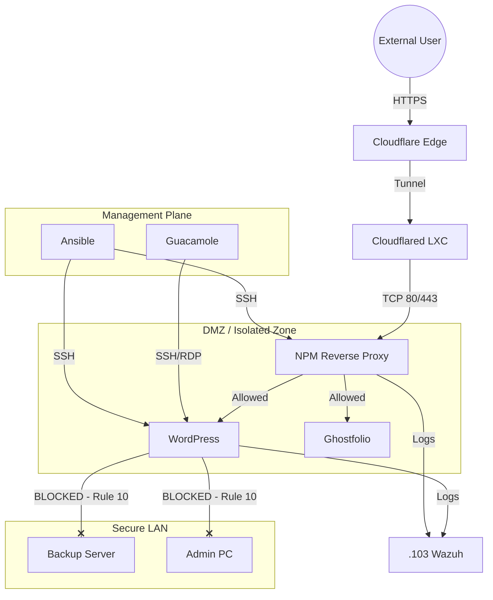

# 13: Security Architecture & Network Segmentation

This document outlines the **Zero Trust** security model implemented within the Proxmox Homelab. The goal is to enforce strict isolation between services, prevent lateral movement, and centralize access control.

---

## 1. Security Philosophy

The network follows a **"Default Deny"** and **"Micro-segmentation"** strategy enabled by the Proxmox Firewall.

* **North-South Traffic (In/Out):** Strictly filtered at the edge (Cloudflare Tunnel) and the Gateway (NPM).
* **East-West Traffic (Internal):** Blocked by default. Containers cannot talk to each other unless explicitly allowed.
* **Management Plane:** Accessible only via specific "Jumpboxes" (Guacamole) or Admin Workstations.

---

## 2. The "Standard Hardening" Security Group

A baseline Security Group (`default-sg`) is applied to **all** LXC containers and VM to ensure consistent policy enforcement. This acts as a "firewall template".

### Detailed Rule Set

| ID | Direction | Action | Protocol | Source/Dest | Port(s) | Description |
| :--- | :--- | :--- | :--- | :--- | :--- | :--- |
| **0** | **IN** | `DROP` | TCP | `192.168.1.51` (Proxy) | 22, 1433, 3306, 5432... | **Critical:** Block sensitive ports (SSH, SQL, Docker) specifically from the Proxy to prevent exploit tunneling. |
| **1** | **IN** | `ACCEPT` | TCP | `192.168.1.51` | 80, 443, 81... | Allow legitimate web traffic forwarding from the Reverse Proxy. |
| **2** | **IN** | `ACCEPT` | UDP | `0.0.0.0/0` | 67, 68 | Allow DHCP assignment. |
| **3** | **IN** | `ACCEPT` | ICMP | `192.168.1.0/24` | - | Allow Ping for internal diagnostics. |
| **4-7**| **IN** | `ACCEPT` | TCP | `192.168.1.55` (Ansible), `192.168.1.54` (Guac), `192.168.1.101` (PC) | 22, 3389, 5900 | Allow Management access from Jumpboxes (Guacamole, PC) and Ansible Controller (SSH Only) |
| **8** | **OUT** | `ACCEPT` | UDP | `192.168.1.50` | 53 | Allow DNS resolution via local AdGuard Home. |
| **9** | **OU** | `ACCEPT` | ICMP | `192.168.1.0/24` | - | Allow Ping for internal diagnostics. |
| **10** | **OUT** | `ACCEPT` | TCP | `192.168.1.103` | 1514, 1515 | **Active:** Agents forwarding logs to SIEM Manager. |
| **11**| **OUT** | `REJECT` | Any | `192.168.1.0/24` | Any | **ISOLATION RULE:** Prevents compromised containers from accessing the LAN. |
| **12**| **OUT** | `ACCEPT` | Any | `0.0.0.0/0` | Any | Allow outgoing Internet access (Updates, API calls). |

---

## 3. Exception Management (Container Level)

While the Security Group enforces isolation, specific infrastructure roles (like Gateways or Proxies) require broader access. These are handled via **Container-Specific Rules** which take precedence over the Security Group.

### A. The Reverse Proxy (NPM Plus - `.51`)
* **Role:** Entry point for HTTP/HTTPS traffic.
* **Exception:** Must communicate with internal web servers to function.
* **Override Rule:** `OUT ACCEPT TCP` -> `192.168.1.0/24` on Ports 80/443 (Allows forwarding to WordPress, Ghostfolio, etc.).

### B. The Remote Gateway (Guacamole - `.54`)
* **Role:** Remote Administration bridging.
* **Exception:** Must reach all management endpoints via RDP/SSH.
* **Override Rule:** `OUT ACCEPT TCP` -> `192.168.1.0/24` on Ports 22, 3389, 5900.

### C. Ansible Automation Controller (.55)
* **Role:** Fleet management and automated deployment.
* **Access Policy:** The controller is authorized to initiate SSH connections to all containers.
* **Override Rule:** `OUT ACCEPT TCP` -> `192.168.1.0/24` on on Port 22.

---

## 4. Traffic Flow Diagram

This diagram visualizes the segmentation logic enforced by the firewall:

---

## 5. Monitoring & SIEM Status (Wazuh)

The infrastructure is now fully monitored by **Wazuh SIEM**. 
* **Deployment:** Agents are deployed across all LXC and VMs using Ansible.
* **Logging:** Real-time log collection and FIM (File Integrity Monitoring) are active.
* **Alerting:** Critical security events are forwarded to Telegram via the Wazuh manager.
* **Firewall Verification:** Log events confirm that unauthorized "East-West" traffic is successfully blocked by Rule #10.

---

## 6. Screenshots

**1. The "Standard Hardening" Security Group Configuration**

**2. Example: AdGuard Home Specific Configuration**

**3. Example: NPM Plus (Reverse Proxy) Exceptions**

